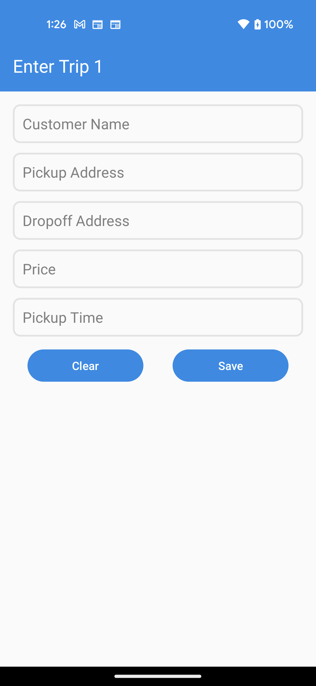
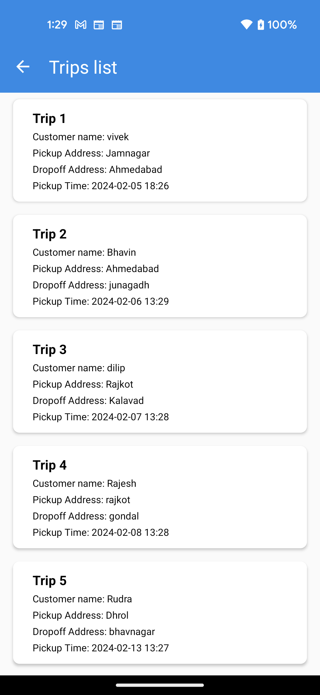
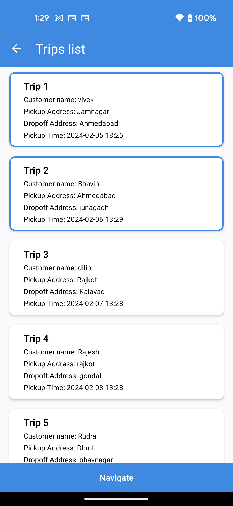
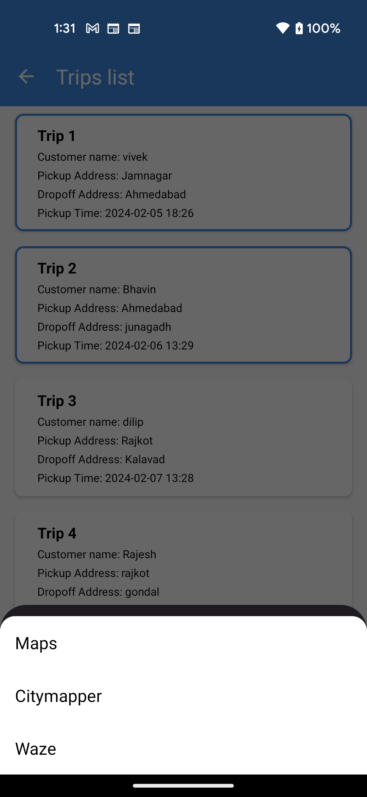

# Trip Navigation App - Draw Trip Navigation Route

## Screen shots
 
 


## Purpose
This demo app is designed to draw the navigation route for one or multiple trips stored in the local database.

## App GUI
The application consists of two screens:
1. Enter Trip Details Screen: Users can enter trip details, which are stored in the local database.
2. Trip List Screen: Users can view a list of trips from the database and initiate trip navigation on the map.

## App Flow
Upon opening the Navigation application, users are directed to the Enter Trip Details screen.

### Screen 1: Enter Trip Details Screen
- Users can enter Customer Name, Pickup Address, Dropoff Address, Price, and Pickup Time.
- Buttons available on the screen: Clear (clears current trip information), Save (saves trip details), Remove All (removes all saved trip details from the Database).
- After entering a minimum of 5 trips in the database, the Next button becomes visible.
- Clicking the Next button redirects users to the Trip List screen.

### Screen 2: Trip List Screen
- Fetches trip information from the database and displays it in a list.
- Displays a sorted list of trips based on the trip pickup time.
- Users can select single or multiple trips from the list.
- Provides a Navigate button to start navigation for the selected trips.
- Clicking the Navigate button opens a list of map-supported apps from the Android device.
- Users select one application from the list to view the navigation route.
- If multiple trips are selected, the route includes all selected trips from start to end.

## Design Pattern Used
MVVM

## Database Used
ROOM

## Code Structure
```
app/
|-- src/
|   |-- main/
|   |   |-- packages/
|   |   |   |-- data/
|   |   |   |   |-- converter/
|   |   |   |   |   |-- converters.kt
|   |   |   |   |-- db/
|   |   |   |   |   |-- TripDao.kt
|   |   |   |   |   |-- TripDatabase.kt
|   |   |   |   |-- model/
|   |   |   |   |   |-- Trip.kt
|   |   |   |-- di/
|   |   |   |   |-- module/
|   |   |   |   |   |-- DBModule.kt
|   |   |   |-- repository/
|   |   |   |   |-- TripRepository.kt
|   |   |   |   |-- activities/
|   |   |   |   |   |-- TripsActivity.kt
|   |   |   |   |-- adapters/
|   |   |   |   |   |-- MapAppAdapter.kt
|   |   |   |   |   |-- TripsAdapter.kt
|   |   |   |   |-- fragments/
|   |   |   |   |   |-- AppsListBottomSheetFragment.kt
|   |   |   |   |   |-- TripDetailFragment.kt
|   |   |   |   |   |-- TripsListFragment.kt
|   |   |   |-- util/
|   |   |   |   |-- Constants.kt
|   |   |   |   |-- Extension.kt
|   |   |   |   |-- GeoCoderHelper.kt
|   |   |   |-- viewmodel/
|   |   |   |   |-- TripViewModel.kt
|   |   |-- MyApp.kt
```

## Logic Used
- Trip Details Screen: Includes 5 EditText fields and 4 buttons for user input and actions.
- Trip List Screen: Displays a list of trips using RecyclerView, allowing selection/unselection of items.
- Navigate Button: Visible when at least one item is selected from the list. Opens a list of map-supported applications, enabling users to select one for navigation.
- Navigation Process: Fetches start and destination points based on selected locations. Handles multiple routes and addresses accordingly.

## Research Done
Explored various methods for opening the system bottom sheet with map-supported applications. Found that different apps have different data acceptance requirements. Additionally, it i found that some services, such as Bing Maps, may have paid or billing features associated with their usage. Ended up using Google Maps for its ability to handle multiple addresses.

Reference related to other apps, refer to this [Stack Overflow post](https://stackoverflow.com/a/25294696/7609347).

For more information, refer to the [Android Developer Guide](https://developer.android.com/guide/components/intents-common.html#ViewMap) and related resources.
